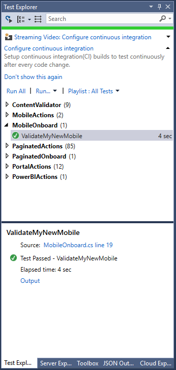
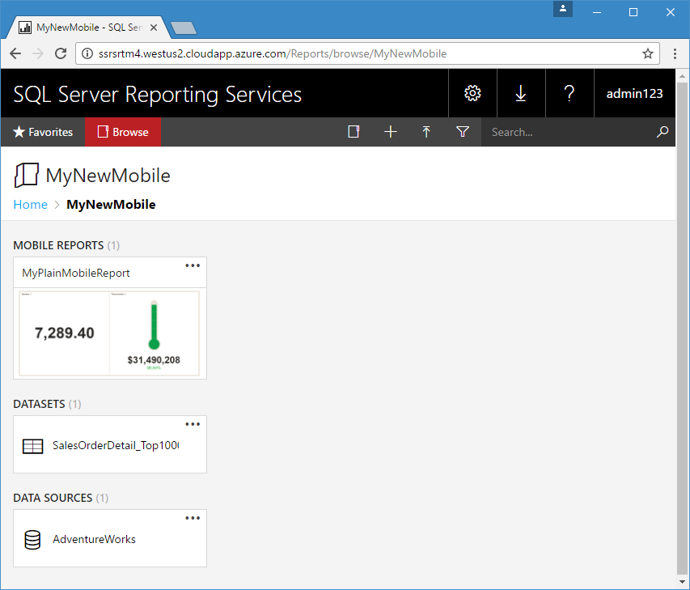
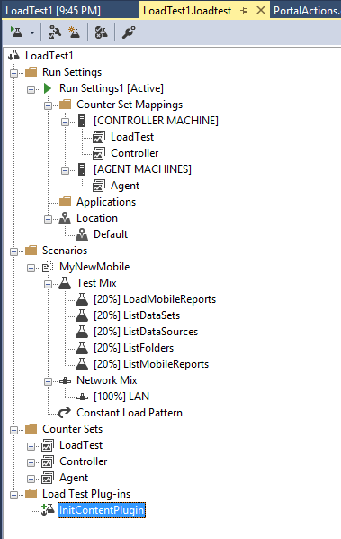
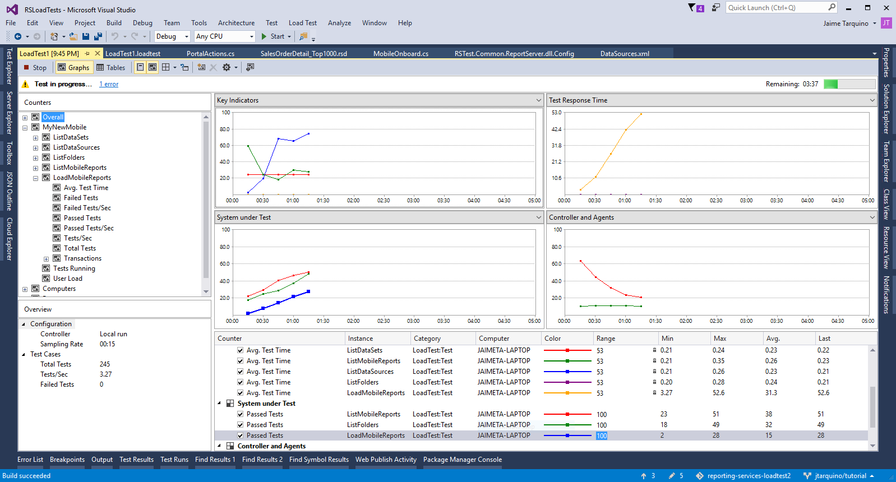

# How to onboard a new Mobile Reports Scenario

For this tutorial , we will create a new scenario called **MyNewMobile** which will contain a new set of your mobile reports and the data sources.

* Create your mobile report, shared dataset and shared data source in your server under the MyNewMobile folder, it should look like this
* In the Visual Studio Solution add a new folder under RSLoad\ContentManager\RuntimeResources\MyNewMobile
* Download the report and the shared dataset from the portal 
* Add the report and the shared dataset to the new folder, it should look like this 


* Add the Data sources that the report uses in the file RSLoad\ContentManager\RuntimeResources\DataSources.xml 

* Ensure the following conditions are met:
    * The data source name in the report matches the one you have in the DataSources.xml 
    * The data source is in the same folder than the report
    * The credentials of the data source are SQL Credentials and those specified in RSTest.Common.ReportServer.dll.Config for the settings DatasourceSQLUser and DatasourceSQLPassword
    * Ensure the mobile report is using the dataset in the same folder 
    * The dataset reference is set to the current folder, you can validate in the xml view of the data set
```xml
<DataSourceReference>/MyNewMobile/AdventureWorks</DataSourceReference>
```

DataSources.xml should looks like this
```xml
<?xml version="1.0" encoding="utf-8" ?>
<DataSources>
  <DataSource Name="AdventureWorks" Extension="SQL"  Database="AdventureWorks" UseWindowsCredential="false" Enabled="true" Prompt="" ImpersonateUser="false"></DataSource>
</DataSources>
```

## Validating the new mobile report, dataset and data source
Now is time to test that the pipeline works correctly, the easiest way to do it is adding a content validation unit test, there is a class in the project ready for this RSLoad\Actions\Mobile\MobileOnboard.cs just edit few lines with **MyNewMobile** and should look like this
```cs
        private static List<string> _loadTestScenariosToDeployInServer = new List<string>() { "MyNewMobile" };
        [TestCategory("DependsOnDatasource")]
        [TestMethod]
        public void ValidateMyNewMobile()
        {
            LoadAllMobileReports();
        }
```
Execute the test 



You can also validate that the report is in the server in the new folder



You can also create KPIs manually in the folder

## Create the new  load scenario

Follow the steps to create the load scenario detailed in the tutorial for [How to onboard a new Paginated Reports Scenario](../master/docs/OnboardPaginated.md)

For mobile reports there is only one test method available LoadMobileReports , this will select randomly one of the reports and execute it during the load test

You can combine it with the Portal tests as ListDatasets, ListDataSources, ListFolders, ListMobileReports and ListKpis





# Advanced Scenario KPIs deployment from your Load Test

In order to deploy KPIs you need the KPI definition, a way to obtain it is examining the JSON response from the server , using the developer view of your browser or fiddler look for the call to CatalogItems, should be something similar to
```
http://yourServer/Reports/api/v1.0/catalogitems(4f5df151-9af6-46f5-bdc8-a9104152a18d)/Model.Folder/catalogitems/?$orderby=name%20ASC
```

In the response look for the KPI definition, it looks like this 

```js
{
  "@odata.type":"#Model.Kpi","Id":"9e4ecc48-7a23-47f9-b6ce-a34dec706a46","Name":"KPI_1000","Description":null,"Path":"/MyNewMobile/KPI_1000","Type":"Kpi","Hidden":false,"Size":-1,"ModifiedBy":"contoso\\admin123","ModifiedDate":"2016-11-05T04:59:15.46Z","CreatedBy":"contoso\\admin123","CreatedDate":"2016-11-05T04:59:15.46Z","ParentFolderId":null,"ContentType":null,"Content":"","Properties":[
	
  ],"IsFavorite":false,"ValueFormat":"General","Visualization":"Bar","DrillthroughTarget":null,"Currency":null,"Values":{
	"Value":"585013","Goal":null,"Status":0.0,"TrendSet":[
	  1.0,6.0,1.0,7.0,1.0,5.0,1.0,6.0,1.0,10.0,1.0,1.0,1.0,1.0,1.0,5.0,1.0,4.0,9.0,2.0,5.0,1.0,6.0,13.0,2.0,21.0,1.0,6.0,8.0,3.0
	]
  },"Data":{
	"Value":{
	  "@odata.type":"#Model.KpiStaticDataItem","Type":"Static","Value":"585013"
	},"Goal":null,"Status":{
	  "@odata.type":"#Model.KpiStaticDataItem","Type":"Static","Value":"0"
	},"TrendSet":{
	  "@odata.type":"#Model.KpiSharedDataItem","Type":"Shared","Id":"010f59c4-d5fc-4c02-83d6-ea18e2f33c4b","Path":"/MyNewMobile/SalesOrderDetail_Top1000","Parameters":[
		
	  ],"Aggregation":"None","Column":"OrderQty"
	}
  }
}
```

Copy that content into your **MyNewMobile** folder into a file with the .kpi extension (for example advancedKpi.kpi) and it will be deployed to the server with the mobile reports, the test that execute those is ListKpis

***Warning*** deploying KPIs using this method is not a typical scenario and can change in future versions of SQL Server Reporting Services without any notice