# How to onboard a new Paginated Reports Scenario

For this tutorial , we will create a new scenario called **MyNewPaginated** which will contain a new set of your reports and the datasources

* In the Visual Studio Solution add a new folder under RSLoad\ContentManager\RuntimeResources\MyNewPaginated
* Add the reports to the new folder, it should look like this 

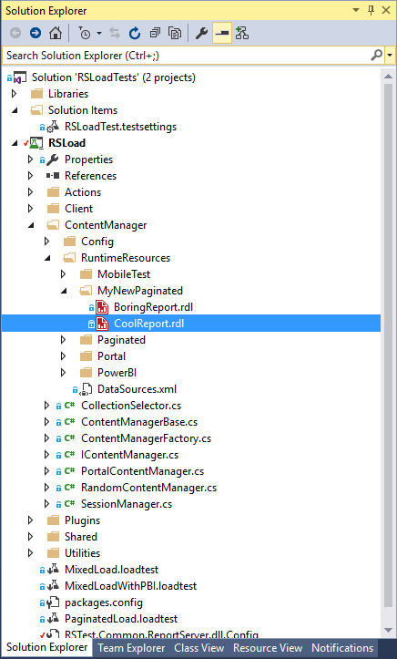

* Add the Data sources that the reports use in the file RSLoad\ContentManager\RuntimeResources\DataSources.xml 

* Ensure the following conditions
    * Your reports uses a shared data source 
    * The data source name in the report matches the one you have in the DataSources.xml 
    * The data source is in the same folder than the report
    * The credentials of the data source are SQL Credentials and those specified in RSTest.Common.ReportServer.dll.Config for the settings DatasourceSQLUser and DatasourceSQLPassword

DataSources.xml should looks like this
```
<DataSource Name="BoringDatasource" Extension="SQL"  Database="AdventureWorks2000" UseWindowsCredential="false" Enabled="true" Prompt="" ImpersonateUser="false"></DataSource>
```

## Validating the new report and data source
Now is time to test that the pipeline works correctly, the easiest way to do it is adding a content validation unit test, there is a class in the project ready for this RSLoad\Actions\Professional\OnboardingContentValidation.cs just edit few lines with **MyNewPaginated** and should look like this
```
private static List<string> _loadTestScenariosToDeployInServer = new List<string>() { "MyNewPaginated" };
[TestMethod]
public void ValidateMyNewPaginate()
{
    ValidateAllReportsRenderHTML5_UnitTest("MyNewPaginated");
}
```
Execute the test 


You can also validate that the report is in the server in the new folder

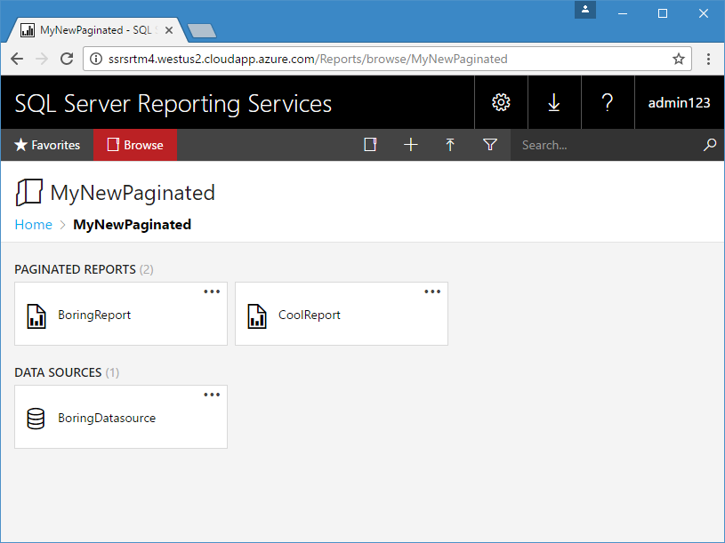

## Create the new  load scenario

Add a new load test to the solution

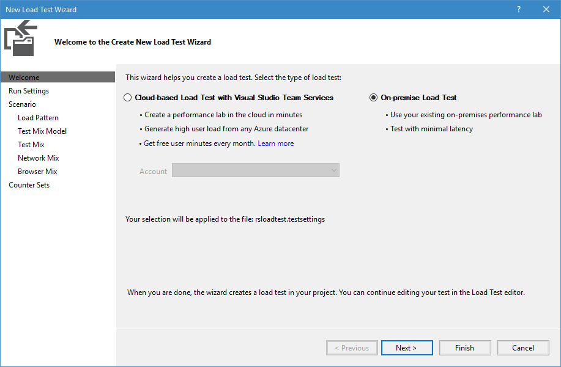

Lets use 1 hour duration

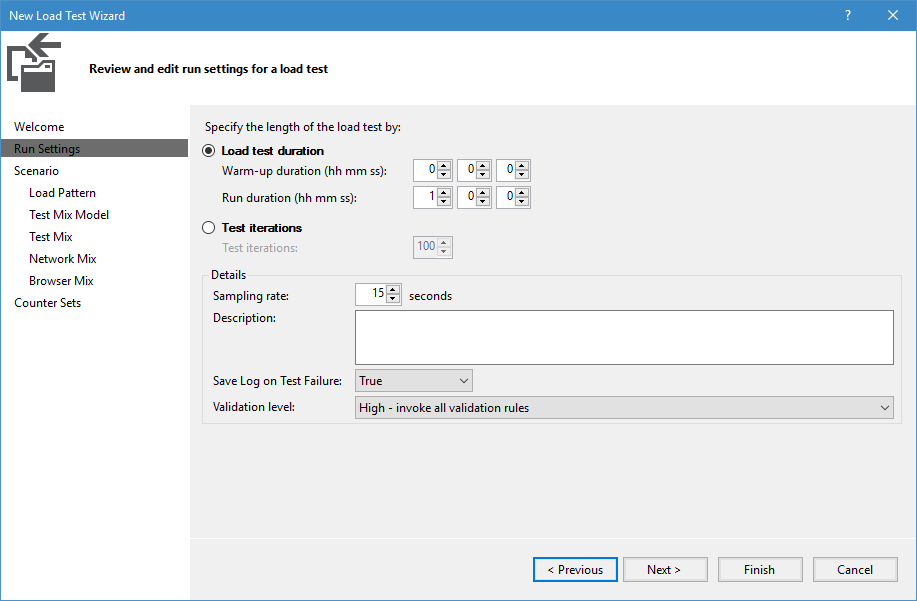

Ensure the scenario is called MyNewPaginated (same that the folder you just added)

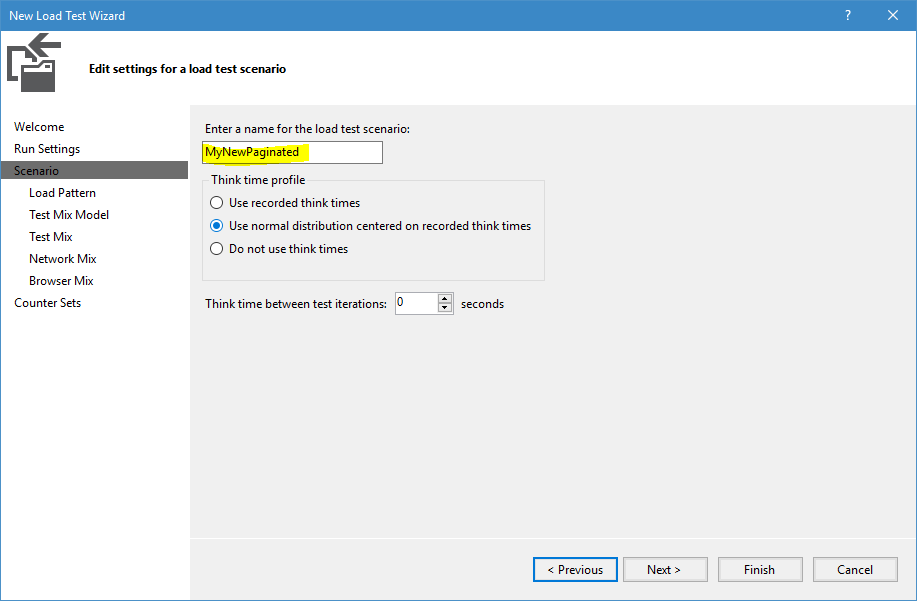

Just for this example lets start with 10 concurrent request with an increase of 10 new users every 600 seconds

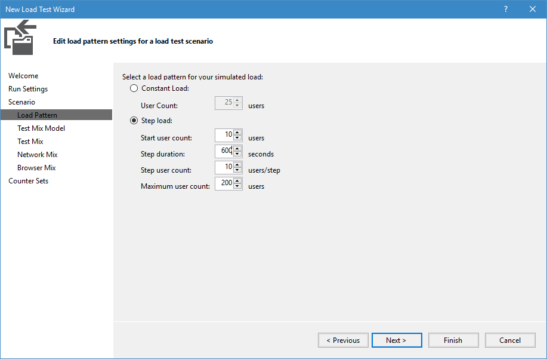

Select the set of actions you want to test with your reports, I have chosen Render , export and a couple of portal actions

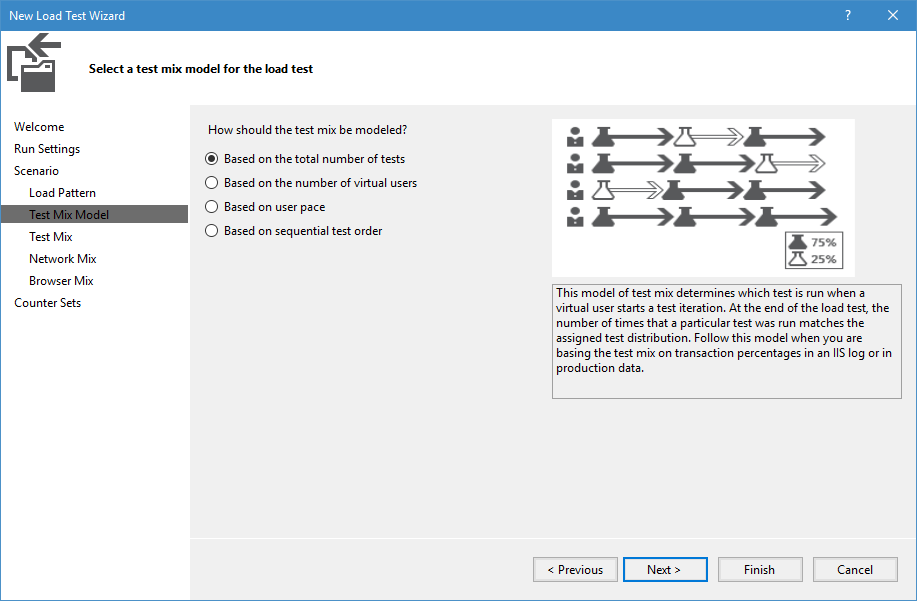

Adjust the percentages

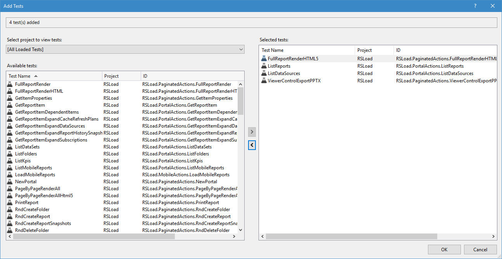

The loadtest should look like this

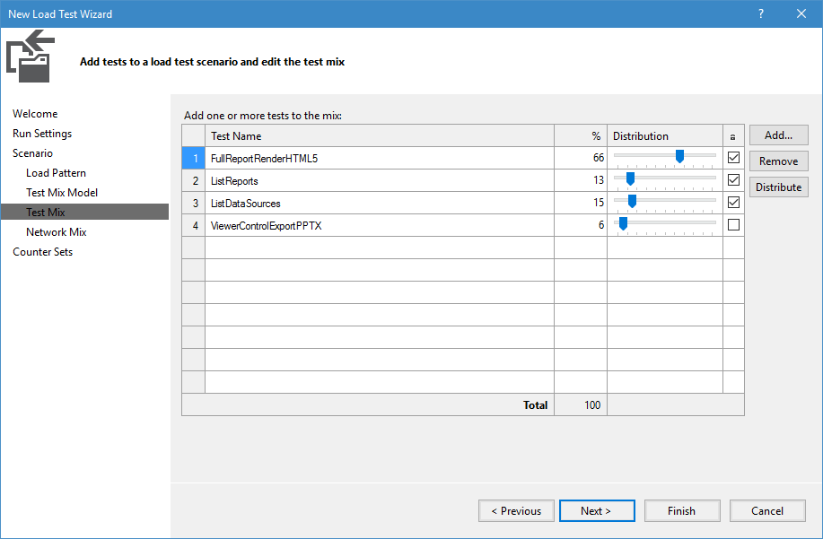

Now add a load test plug-in 

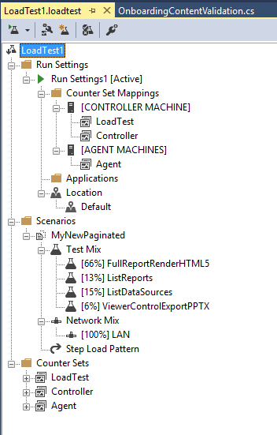

The only available is InitContentPlugin, this step is important as this Plug-in takes care of initializing the tests and publish the reports and data sources to the server

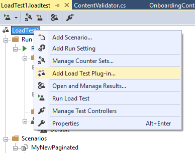

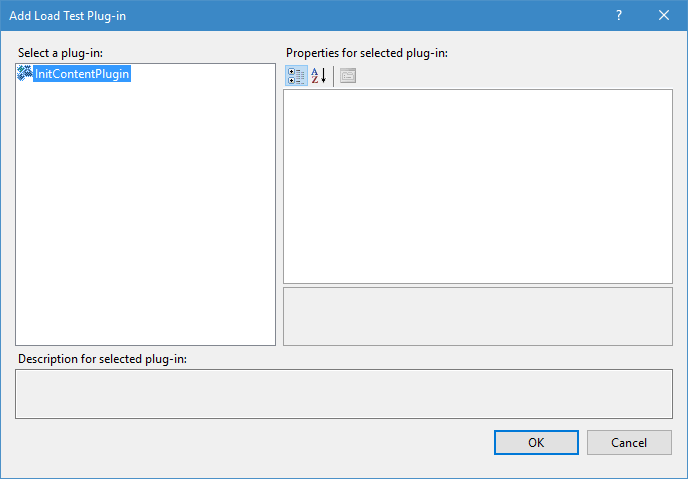

And now is time to run the test

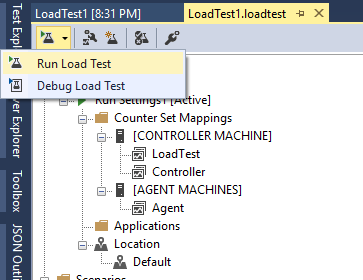

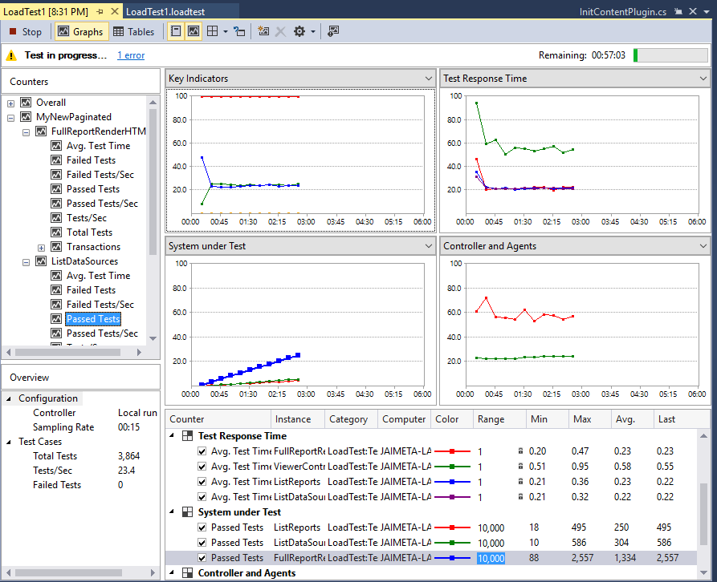

You can see the results for each of your reports and the other actions you selected in the summary report when the load run is completed

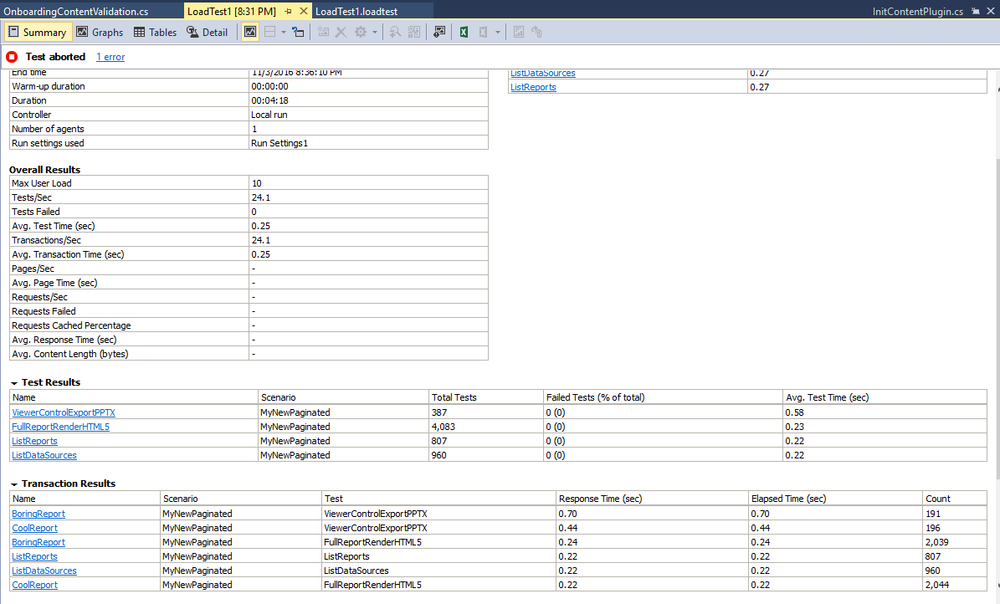

Pro Tip: The load tests run in an agent in your machine so you won't see the traces and logs in Visual Studio , however you can use [dbgview](https://technet.microsoft.com/en-us/sysinternals/debugview.aspx) to see the traces from the test meanwhile is executing

